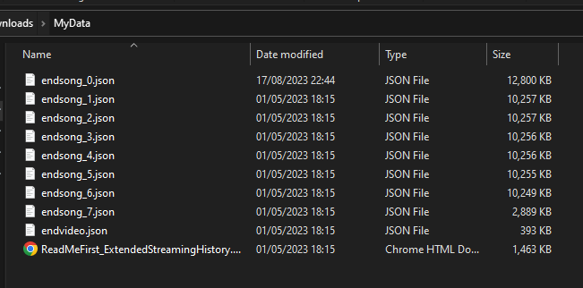

# Spotify Data Info

## Downloading Your Spotify Data

Go to your Spotify [privacy settings](https://www.spotify.com/account/privacy/), then scroll down to **Download your data**.


Follow the instructions to download the files, which can take several days to prepare.
Note that these only contain the past **12 months** of data.

Once you've downloaded your data, make sure to extract / decompress the ZIP archive.

Navigate to the directory containing the following files. This is the path you should use in the below usage.



## Using the Tool

### Setup

Install [Node.js](https://nodejs.dev/).

Clone the repository:

```bash
git clone https://github.com/ciaran1344/spotify-data-info
```

Install the project dependencies:

```bash
cd ./spotify-data-info
npm install
```

### Sample Usage

Basic usage:

```bash
npm run count -- --path="C:\Users\ciaran\Downloads\my_spotify_data\MyData"
```

Top 50 entries:

```bash
npm run count -- --path="C:\Users\ciaran\Downloads\my_spotify_data\MyData" --limit=50
```

Top entries before a date:

```bash
npm run count -- --path="C:\Users\ciaran\Downloads\my_spotify_data\MyData" --cutoff="2021/02/14"
```

Top entries played longer than 30 seconds:

```bash
npm run count -- --path="C:\Users\ciaran\Downloads\my_spotify_data\MyData" --threshold=30
```

### Command Line Arguments

| Flag          | Description                                                                                                                                                                            |
| ------------- | -------------------------------------------------------------------------------------------------------------------------------------------------------------------------------------- |
| `--path`      | Path to your Spotify data directory. **Required**.                                                                                                                                     |
| `--cutoff`    | Remove any track play after the passed date. Accepts all date formats parsable by [`new Date`](https://developer.mozilla.org/en-US/docs/Web/JavaScript/Reference/Global_Objects/Date). |
| `--limit`     | Number of artists to display. Will list all results if omitted.                                                                                                                        |
| `--threshold` | Remove any track play shorter than the passed duration. Specified in seconds.                                                                                                          |

## Contributing

Feel free to open a PR with contributions ❤️.
